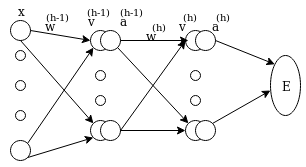

# Лабораторная работa No1
# Реализация метода обратного распространения ошибки для двуслойной полностью связанной нейронной сети

### Вывод математических формул

А каждом слое есть веса данные матрицой
})
где s обазначивает слой.

На изображении не показаны узлы и веса смешения, потому что всё проще если добавлять единицу в входные векторы. В конце из всех формул легко выделяем части связанные с смещением, а это понадобится для программной реализации.

&space;=&space;\phi(v_k))

Е представляет функцию ошибки, целевую функцию, которую хотим минимизировать.

}(w^{(h)}a^{(h-1)})))&space;=&space;E(\phi^{(h)}(w^{(h)}\phi^{(h-1)}(w^{(h-1)}a^{(h-2)})))));&space;a^{(0)}&space;=&space;x)

}_{i,j}}&space;=&space;\frac{\partial&space;E}{\partial&space;a^{(h)}_{i}}\frac{\partial&space;a^{(h)}_{i}}{\partial&space;v^{(h)}_{i}}\frac{\partial&space;v^{(h)}_{i}}{\partial&space;w^{(h)}_{i,j}}&space;=&space;\frac{\partial&space;E}{\partial&space;v^{(h)}_{i}}a^{(h-1)}_j&space;=&space;\delta^{(h)}a^{(h-1)}_j)

}_{i,j}}&space;=&space;\sum_k\frac{\partial&space;E}{\partial&space;a^{(h)}_{k}}\frac{\partial&space;a^{(h)}_{k}}{\partial&space;v^{(h)}_{k}}\frac{\partial&space;v^{(h)}_{k}}{\partial&space;a^{(h-1)}_i}\frac{\partial&space;a^{(h-1)}_i}{\partial&space;v^{(h-1)}_i}\frac{\partial&space;v^{(h-1)}_i}{\partial&space;w^{(h)}_{i,j}}&space;=&space;\frac{\partial&space;E}{\partial&space;v^{(h-1)}_i}a^{(h-1)}_j&space;=&space;\delta^{(h-1)}_i&space;a^{(h-2)}_j)

Продолжая выводить формулы для последовательных слоев,  получаем общую формулу.

}_i&space;=&space;\frac{\partial&space;E}{\partial&space;v^{(s-1)}_i}&space;=&space;\phi^{(s-1)'}(v^{(s-1)}_i)\sum_k\delta^{(s)}_kw^{(s)}_{k,i})

}_i&space;=&space;\frac{\partial&space;E}{\partial&space;v^{(h)}_i})

}_{k,i}}&space;=&space;\delta^{(s)}_i&space;a^{(s-1)}_j)

Если использовать softmax функцию активации и кросс-энтропийную функцию ошибки, получаем следующие формулы:
Softmax активация:
}(v^{(h)}_i)&space;=&space;\frac{e^{v^{(h)}_i}}{\sum_ke^{v^{(h)}_k}})

Softmax это апостериорная вероятность того, что пример тренировочной
выборки принадлежит данному классу.

&space;=&space;\prod^N_{n=1}\prod^K_{j=1}(\frac{e^{v^{(h)}_i}}{\sum_ke^{v^{(h)}_k}})^{y^{(n)}_j})

Максимизация функции правдоподобия может быть сведена к минимизации логарифма.

&space;=&space;-1/N\ln\prod^N_{n=1}\prod^K_{j=1}(\frac{e^{v^{(h)}_i}}{\sum_ke^{v^{(h)}_k}})^{y^{(n)}_j}&space;=&space;-1/N\sum^N_{n=1}\sum^K_{j=1}y^{(n)}_j\frac{e^{v^{(h)}_i}}{\sum_ke^{v^{(h)}_k}})

}_i}&space;=&space;\sum^K_{j=1,&space;j&space;\neq&space;i}(y_j\frac{e^{v^{(h)}_j}}{\sum_ke^{v^{(h)}_k}})&space;&plus;&space;y_i\frac{e^{v^{(h)}_i}}{\sum_ke^{v^{(h)}_k}}&space;-&space;y_i&space;=&space;\sum^K_{j=1}(y_j\frac{e^{v^{(h)}_j}}{\sum_ke^{v^{(h)}_k}})&space;-&space;y_i&space;=&space;\frac{e^{v^{(h)}_j}}{\sum_ke^{v^{(h)}_k}})&space;-&space;y_i&space;=&space;a^{(h)}_i&space;-&space;y_i&space;=&space;\delta^{(h)}_i)

Теперь, чтобы запрограммировать обратное распространение ошибки, нужно ещё только производную функции ReLU (ReLU(x) = max(x, 0)), которую мы будем использовать.

ReLU'(x) = I(x > 0) = 1{x > 0}

### Псевдокод алгоритма
